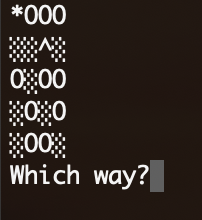

# Find Your Hat - A Silly Terminal Game 
*Based on a Codecademy project*

The scenario is that the player has lost their hat in a field full of holes, and they must navigate back to it without falling down one of the holes or stepping outside of the field.

*The project is utilizing the prompt-sync Node module*

https://github.com/heapwolf/prompt-sync

`npm install prompt-sync`

## FEATURES
1. The player can select the direction in which they would like to head. The game prompts the player for a new direction if they would head off of the field.
2. The Field class includes a method for generating a randomized field based on dimension inputs.
3. The randomized field also contains a certain number of "holes" - the player can determine the probability that any given field is a hole and thus adjust the difficulty of the game.

## ROOM FOR IMPROVEMENT
- Prompt the user to input the dimension and difficulty for the random field instead of determining these in the code.
- Handling moves in a "circle": currently when the player moves back-and-forth between two fields, the previously visited field turns back into a "field" character. However, this would also happen if they just cross their previous path.
- Making sure that there is always a possible way to the hat
